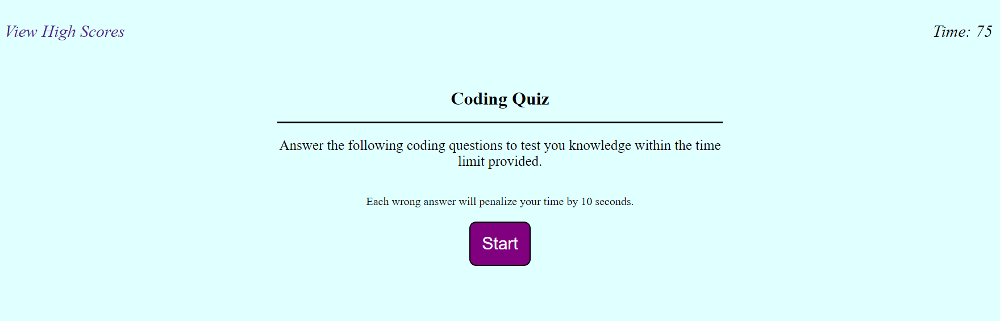

# Coding Quiz

Test your knowledge of basic coding terminology. By taking this short, five question quiz, you can test your basic knowledge of JavaScript.

To start this quiz, please click on the start button.  When you start the quiz, the timer at the top right of the page will start a count down from seventy-five seconds.  If you get an answer wrong, you will have a visual indicator in which the answer you selected will turn red.  You will also have a ten second deduction from your remaining time.  If your answer is correct, the selected answer will turn green. 

Once you complete the quiz, you will be prompted to enter your initials for your score to be displayed and saved in the local storage.  The remaining time will be your score.  Once you have submitted your initials, you may click on the back prompt to go back to the main page and try to beat your previous score, or you may click on clear for all scores listed to be removed.  

## Visuals

## Live Site Link

https://jjray84.github.io/Coding-Quiz/
